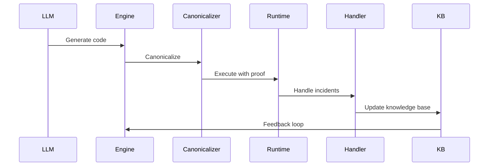

# Architecture

Discovery Engine 2‑Cat is built on a solid mathematical foundation with clear separation of concerns and well-defined interfaces.

## Core Components

### 2‑Category Engine
The mathematical foundation for compositional reasoning about complex systems.

```python
class TwoCategoryEngine:
    def __init__(self):
        self.objects = {}  # Objects in the category
        self.morphisms = {}  # Morphisms between objects
        self.composition = {}  # Composition rules
    
    def compose(self, f, g):
        """Compose morphisms f and g."""
        return self.composition.get((f, g))
    
    def identity(self, obj):
        """Get identity morphism for object."""
        return self.morphisms.get((obj, obj))
```

### E‑Graph Canonicalizer
Ensures non-redundant exploration by maintaining equivalence classes.

```python
class EGraphCanonicalizer:
    def __init__(self):
        self.equivalence_classes = {}
        self.canonical_representatives = {}
    
    def canonicalize(self, data):
        """Canonicalize data using e-graph rules."""
        # Apply equivalence rules
        # Return canonical representative
        pass
    
    def add_rule(self, rule):
        """Add new equivalence rule."""
        pass
```

### PCAP/DCA Runtime
Proof-carrying action with deterministic control architecture.

```python
class PCAPDCARuntime:
    def __init__(self):
        self.proof_cache = {}
        self.control_plane = {}
    
    def execute_action(self, action, proof):
        """Execute action with proof."""
        if self.verify_proof(proof):
            return self.control_plane.execute(action)
        else:
            raise ProofVerificationError()
    
    def verify_proof(self, proof):
        """Verify proof using SMT solver."""
        pass
```

### Incident Handler
Transforms incidents into rules and tests using HS-Tree algorithm.

```python
class IncidentHandler:
    def __init__(self):
        self.hstree = HSTreeMinimalTests()
        self.rule_generator = RuleGenerator()
    
    def handle_incident(self, incident):
        """Handle incident and generate rules."""
        # Generate minimal tests using HS-Tree
        tests = self.hstree.generate_minimal_tests(incident)
        
        # Generate rules from incident
        rules = self.rule_generator.generate_rules(incident)
        
        # Update knowledge base
        self.update_knowledge_base(tests, rules)
        
        return {"tests": tests, "rules": rules}
```

## Data Flow



## Key Interfaces

### 2‑Category Operations
- **Normalize**: Canonicalize data structures
- **Verify**: Verify properties using formal methods
- **Meet**: Combine multiple results
- **Retrieve**: Access stored information

### Proof Operations
- **Generate**: Create proofs for actions
- **Verify**: Verify proof correctness
- **Compose**: Combine multiple proofs
- **Cache**: Store and retrieve proofs

### Incident Operations
- **Detect**: Identify constraint violations
- **Classify**: Categorize incident types
- **Generate**: Create minimal tests
- **Learn**: Update knowledge base

## Configuration

### Domain Specification
```json
{
  "domain": "regtech",
  "constraints": [
    {
      "type": "semver",
      "condition": "version >= previous_version",
      "message": "Version downgrade not allowed"
    }
  ],
  "budgets": {
    "verify_ms": 5000,
    "normalize_ms": 1000,
    "meet_ms": 2000
  },
  "timeouts": {
    "operation_timeout": 10000,
    "global_timeout": 15000
  }
}
```

### Policy Configuration
```json
{
  "ids": {
    "lambda": 0.6
  },
  "risk_policy": {
    "cvar_alpha": 0.9
  },
  "diversity": {
    "threshold": 0.8,
    "max_retries": 3
  }
}
```

## Security Model

### Hermetic Execution
- **Isolation**: Docker containers with minimal attack surface
- **Determinism**: Frozen dependencies and deterministic execution
- **Attestation**: Cryptographic proof of execution integrity

### Proof Verification
- **SMT Solvers**: Z3, CVC4 for formal verification
- **Proof Assistants**: Coq, Lean for complex proofs
- **Model Checkers**: SPIN, TLA+ for temporal properties

### Vulnerability Management
- **SBOM**: Software Bill of Materials with vulnerability scanning
- **Dependency Pinning**: Exact version pinning for all dependencies
- **Security Scanning**: Automated vulnerability detection

## Performance Optimization

### Parallel Processing
- **Multi-threading**: Parallel verification of independent properties
- **GPU Acceleration**: CUDA support for SMT solving
- **Distributed Computing**: Multi-node verification for large problems

### Caching
- **Proof Cache**: Store and reuse verification results
- **Canonical Cache**: Cache canonicalized data structures
- **Metrics Cache**: Cache performance metrics

### Budget Management
- **Dynamic Budgets**: Adjust budgets based on historical performance
- **Timeout Management**: Intelligent timeout handling
- **Resource Monitoring**: Real-time resource usage tracking

## Monitoring and Observability

### Metrics
- **Coverage**: Percentage of use cases covered by proofs
- **Novelty**: Uniqueness of generated solutions
- **Audit Cost**: Time and effort for compliance verification
- **Incident Rate**: Frequency of constraint violations

### Logging
- **Structured Logging**: JSON logs with correlation IDs
- **Audit Trail**: Complete trace of all operations
- **Performance Logs**: Detailed timing and resource usage

### Alerting
- **Incident Alerts**: Real-time notification of constraint violations
- **Performance Alerts**: Resource usage and timeout alerts
- **Security Alerts**: Vulnerability and security incident alerts

## Deployment

### Docker Deployment
```dockerfile
FROM python:3.11-slim

# Install dependencies
COPY requirements.txt .
RUN pip install -r requirements.txt

# Copy application
COPY . /app
WORKDIR /app

# Run application
CMD ["python", "scripts/demo_regtech_bench.py"]
```

### Kubernetes Deployment
```yaml
apiVersion: apps/v1
kind: Deployment
metadata:
  name: discovery-engine-2cat
spec:
  replicas: 3
  selector:
    matchLabels:
      app: discovery-engine-2cat
  template:
    metadata:
      labels:
        app: discovery-engine-2cat
    spec:
      containers:
      - name: discovery-engine-2cat
        image: discovery-engine-2cat:v0.1.0
        ports:
        - containerPort: 8080
        env:
        - name: DISCOVERY_SEED
          value: "42"
```

## Testing

### Unit Tests
- **Core Components**: Test individual components in isolation
- **Integration Tests**: Test component interactions
- **Performance Tests**: Benchmark critical paths

### End-to-End Tests
- **Determinism Tests**: Verify reproducible results
- **Compliance Tests**: Verify regulatory compliance
- **Security Tests**: Verify security properties

### Property-Based Testing
- **QuickCheck**: Random testing of properties
- **Hypothesis**: Python property-based testing
- **Fuzzing**: Automated vulnerability discovery

## Maintenance

### Updates
- **Dependency Updates**: Automated dependency updates with testing
- **Security Patches**: Immediate security patch deployment
- **Feature Updates**: Gradual feature rollout with monitoring

### Monitoring
- **Health Checks**: Automated health monitoring
- **Performance Monitoring**: Real-time performance tracking
- **Security Monitoring**: Continuous security assessment

### Backup and Recovery
- **Data Backup**: Regular backup of knowledge base and metrics
- **Disaster Recovery**: Complete system recovery procedures
- **Version Control**: Git-based version control for all components

---

*Discovery Engine 2‑Cat — Manufacturing proof for generative reasoning in code*