# Discovery Engine 2‑Cat

**A Proof Engine for Code**

Discovery Engine 2‑Cat is a proof engine for generative code that addresses the fundamental challenge of ensuring that AI-generated code is not just syntactically correct, but logically sound and compliant with regulatory requirements.

## Key Features

### 🔗 **2‑Categorical Foundation**
Mathematical foundation for compositional reasoning about complex systems, ensuring logical consistency across all operations.

### 🎯 **Non‑Redundant Exploration**
E‑graphs combined with Diversity-Preserving Policy (DPP) guarantee that every exploration brings measurable novelty.

### 🛡️ **Proof‑Carrying Action**
PCAP/DCA (Proof-Carrying Action/Deterministic Control Architecture) applies formal proof principles to code generation.

### 🔄 **Antifragile Learning**
Incident→rule mechanism: every incident generates rules that enrich the knowledge base K and improve system robustness.

## Performance Metrics

<div class="grid cards" markdown>

-   :material-chart-line:{ .lg .middle } **Coverage Gain**

    ---

    **+20%** over baseline methods

-   :material-lightbulb-on:{ .lg .middle } **Novelty Improvement**

    ---

    **+22%** average novelty score

-   :material-clock-fast:{ .lg .middle } **Audit Cost Reduction**

    ---

    **-15%** p95 audit time

-   :material-shield-check:{ .lg .middle } **Security**

    ---

    **0 High/Critical** vulnerabilities

</div>

## Quick Start

### Installation

```bash
# Clone the repository
git clone https://github.com/your-org/discovery-engine-2cat.git
cd discovery-engine-2cat

# Create virtual environment
python -m venv .venv
source .venv/bin/activate  # On Windows: .venv\Scripts\activate

# Install dependencies
pip install -r requirements.txt
```

### Basic Usage

```bash
# Run RegTech demo
make regtech-demo

# Check determinism
make determinism

# Calibrate budgets
make calibrate-budgets

# Generate Grove one-pager
make grove-pack
```

### Verify Results

```bash
# Check metrics
cat out/metrics.json

# Verify Merkle root
cat out/journal/merkle.txt

# Check SBOM
cat out/sbom.json
```

## Architecture

```mermaid
graph TB
    A[LLM] --> B[2‑Cat Engine]
    B --> C[E‑Graph Canonicalizer]
    C --> D[PCAP/DCA Runtime]
    D --> E[Incident Handler]
    E --> F[Knowledge Base K]
    F --> B
    
    G[Verification Tools] --> D
    H[Compliance Policies] --> E
    I[Metrics Engine] --> J[Audit Reports]
```



## Use Cases

### Financial Services
- **Regulatory Compliance**: AI-generated trading algorithms with formal guarantees
- **Audit Trail**: Complete proof chain for regulatory auditors
- **Risk Management**: Quantified risk metrics and incident learning

### Healthcare
- **Medical AI**: Audited AI systems for healthcare applications
- **Compliance**: HIPAA, FDA, and other regulatory requirements
- **Safety**: Formal verification of medical AI systems

### Enterprise
- **Code Generation**: AI-generated code with formal guarantees
- **Compliance**: Automated compliance checking and reporting
- **Quality**: Measurable code quality improvements

## Getting Started

### 1. Explore the Documentation
- [Architecture](architecture.md) - Technical architecture overview
- [Benchmarks](benchmarks.md) - Performance benchmarks and results
- [Proofs](proofs.md) - Formal verification and proof methods

### 2. Try the Examples
- [RegTech Demo](examples/regtech.md) - Regulatory compliance example
- [Financial Services](examples/financial.md) - Trading algorithm example
- [Healthcare](examples/healthcare.md) - Medical AI example

### 3. Join the Community
- [GitHub Discussions](https://github.com/your-org/discovery-engine-2cat/discussions)
- [Discord Server](https://discord.gg/your-org)
- [Mailing List](https://groups.google.com/forum/#!forum/discovery-engine-2cat)

## Grove Program

We're applying to the Grove program to co‑design the standard of proof for generative code. Join us in building the future of auditable AI systems.

### Application Materials
- [One-Pager](grove/one-pager.md) - Executive summary
- [Essays](grove/essays.md) - Detailed application essays
- [Video Script](grove/video_script_90s.md) - 90-second presentation
- [FAQ](grove/faq.md) - Frequently asked questions

### Pilot Program
- **Duration**: 4 weeks
- **Scope**: RegTech compliance
- **Deliverables**: Measurable ROI and compliance improvements
- **Support**: Dedicated technical support and training

## License

This project is licensed under the MIT License - see the [LICENSE](license.md) file for details.

## Contributing

We welcome contributions! Please see our [Contributing Guide](contributing.md) for details on how to get started.

---

*Discovery Engine 2‑Cat — Manufacturing proof for generative reasoning in code*
