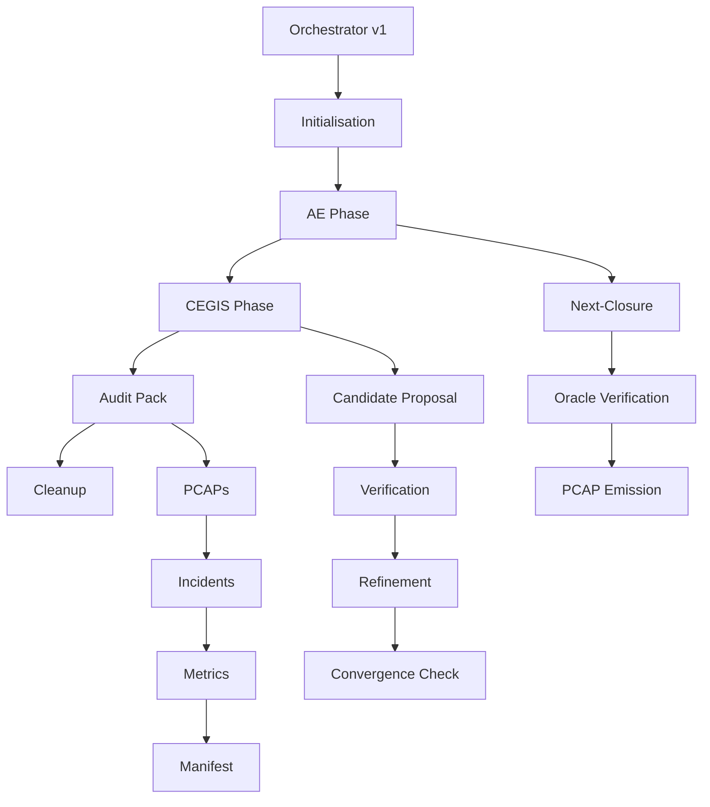

# 🚀 Orchestrator v1 - Industrial Pipeline

## 📋 Vue d'ensemble

L'Orchestrator v1 est la version industrielle du pipeline de découverte, remplaçant tous les composants mockés par de vrais moteurs, adaptateurs et planificateurs. Il exécute des algorithmes FCA réels, de la synthèse CEGIS, et de la vérification concurrente avec gestion des budgets et émission d'incidents.

## 🏗️ Architecture

### Composants Réels

#### **Moteurs**
- **`RealAEEngine`** : Implémentation FCA avec Next-Closure et statistiques
- **`RealCegisEngine`** : Boucle CEGIS avec synthèse et raffinement réels
- **`AsyncScheduler`** : Planificateur asynchrone avec `asyncio.gather` et timeouts
- **`BudgetManager`** : Gestion des budgets avec backoff exponentiel

#### **Adaptateurs**
- **`LLMAdapter`** : Appels API LLM concurrents avec retry et rate limiting
- **`Verifier`** : Vérification multi-outils (analyse statique, tests, propriétés)
- **`OracleAdapter`** : Interface avec oracle de domaine
- **`BanditStrategy`** : Stratégie de sélection multi-armed bandit
- **`DiversityStrategy`** : Stratégie de diversité pour exploration

#### **Gestion d'Incidents**
- **`FailReasonFactory`** : Création d'incidents structurés
- **`IncidentManager`** : Gestion des incidents avec sévérité
- **`IncidentEmitter`** : Émission d'incidents vers le bus d'événements

### Pipeline d'Exécution



## 🎯 Fonctionnalités

### **Exécution Concurrente**
- **LLM + Verifier** : Appels parallèles avec timeouts
- **AE + CEGIS** : Phases séquentielles avec concurrence interne
- **Budget Management** : Surveillance en temps réel avec backoff

### **Gestion des Budgets**
- **Time Budgets** : Timeouts par opération et phase
- **Token Budgets** : Limitation des tokens LLM
- **API Call Budgets** : Limitation des appels API
- **Memory Budgets** : Surveillance de la mémoire

### **Sécurité d'Annulation**
- **Task Cancellation** : Annulation sûre des tâches restantes
- **Resource Cleanup** : Nettoyage des ressources
- **State Persistence** : Sauvegarde de l'état avant annulation

### **Émission d'Incidents**
- **FailReason Types** : `time_budget_exceeded`, `max_iters_reached`, etc.
- **Severity Levels** : `low`, `medium`, `high`, `critical`
- **Structured Context** : Contexte détaillé pour chaque incident

## 🚀 Utilisation

### **Installation**

```bash
# Installer les dépendances
make -f Makefile.orchestrator_v1 install

# Configuration de l'environnement
export OPENAI_API_KEY="your_api_key"
export ORCHESTRATOR_V1_CONFIG="config.yaml"
```

### **Démonstration Complète**

```bash
# Démonstration end-to-end
make -f Makefile.orchestrator_v1 demo

# Démonstration rapide
make -f Makefile.orchestrator_v1 demo-quick

# Analyse des résultats
make -f Makefile.orchestrator_v1 demo-audit
```

### **Tests**

```bash
# Tests complets
make -f Makefile.orchestrator_v1 test

# Tests spécifiques
make -f Makefile.orchestrator_v1 test-orchestrator-v1
make -f Makefile.orchestrator_v1 test-real-components

# Tests de performance
make -f Makefile.orchestrator_v1 test-performance
```

### **Validation**

```bash
# Validation complète
make -f Makefile.orchestrator_v1 validate

# Linting et formatage
make -f Makefile.orchestrator_v1 lint
make -f Makefile.orchestrator_v1 format
```

## 📊 Configuration

### **OrchestratorV1Config**

```python
config = OrchestratorV1Config(
    # Timeouts
    ae_timeout=30.0,
    cegis_propose_timeout=10.0,
    cegis_verify_timeout=15.0,
    cegis_refine_timeout=10.0,

    # CEGIS parameters
    cegis_max_iterations=10,
    cegis_max_stable_no_improve=3,

    # Real component settings
    enable_budget_management=True,
    enable_async_scheduler=True,
    enable_failreason_emission=True,

    # LLM settings
    llm_api_url="https://api.openai.com/v1/chat/completions",
    llm_api_key="your_key",
    llm_model="gpt-4",
    llm_max_tokens=2048,
    llm_temperature=0.1,

    # Verifier settings
    verifier_timeout=20.0,
    verifier_tools=["static_analysis", "property_check", "test_execution"],

    # Scheduler settings
    max_concurrent_tasks=10,
    scheduler_timeout=30.0,

    # Budget settings
    budget_warning_threshold=0.8,
    budget_critical_threshold=0.95,
    budget_overrun_threshold=1.0
)
```

### **Budgets**

```python
budgets = {
    "ae_timeout": 30.0,
    "cegis_timeout": 60.0,
    "llm_max_tokens": 10000,
    "llm_temperature": 0.1,
    "verify_timeout": 20.0,
    "total_budget": 300.0,
    "time": 180.0,
    "tokens": 50000,
    "api_calls": 100
}
```

### **Thresholds**

```python
thresholds = {
    "min_confidence": 0.8,
    "max_iterations": 10,
    "success_rate": 0.9,
    "min_concepts": 3,
    "max_incidents": 5,
    "convergence_threshold": 0.95
}
```

## 🔧 API

### **OrchestratorV1**

```python
from orchestrator.orchestrator_v1 import OrchestratorV1, OrchestratorV1Config

# Créer l'orchestrateur
orchestrator = OrchestratorV1(
    config=config,
    ae_engine=ae_engine,
    cegis_engine=cegis_engine,
    llm_adapter=llm_adapter,
    verifier=verifier,
    scheduler=scheduler,
    budget_manager=budget_manager,
    event_bus=event_bus
)

# Exécuter le pipeline
state = await orchestrator.run(domain_spec, budgets, thresholds)
```

### **RealAEEngine**

```python
from orchestrator.engines.real_ae_engine import RealAEEngine

# Créer le moteur AE
ae_engine = RealAEEngine(
    oracle_adapter=oracle_adapter,
    bandit_strategy=bandit_strategy,
    diversity_strategy=diversity_strategy
)

# Initialiser
await ae_engine.initialize(domain_spec)

# Exécuter une étape
result = await ae_engine.next_closure_step(ae_context)
```

### **RealCegisEngine**

```python
from orchestrator.engines.real_cegis_engine import RealCegisEngine

# Créer le moteur CEGIS
cegis_engine = RealCegisEngine(
    llm_adapter=llm_adapter,
    verifier=verifier,
    synthesis_strategy=synthesis_strategy,
    refinement_strategy=refinement_strategy
)

# Initialiser
await cegis_engine.initialize(domain_spec)

# Proposer un candidat
candidate = await cegis_engine.propose(cegis_context)

# Vérifier le candidat
verdict = await cegis_engine.verify(candidate, cegis_context)

# Raffiner le candidat
refined = await cegis_engine.refine(candidate, counterexample, cegis_context)
```

### **LLMAdapter**

```python
from orchestrator.adapters.llm_adapter import LLMAdapter, LLMConfig

# Configuration
llm_config = LLMConfig(
    api_url="https://api.openai.com/v1/chat/completions",
    api_key="your_key",
    model="gpt-4",
    max_tokens=2048,
    temperature=0.1,
    timeout=30.0,
    max_retries=3,
    concurrent_requests=5
)

# Créer l'adaptateur
llm_adapter = LLMAdapter(llm_config)

# Initialiser
await llm_adapter.initialize(domain_spec)

# Générer du texte
response = await llm_adapter.generate(prompt, max_tokens=1024)

# Générer une implémentation
implementation = await llm_adapter.generate_implementation(
    specification=spec,
    context=context,
    constraints=constraints
)
```

### **Verifier**

```python
from orchestrator.adapters.verifier import Verifier, VerificationConfig

# Configuration
verifier_config = VerificationConfig(
    timeout=20.0,
    max_retries=3,
    concurrent_verifications=5,
    tools=["static_analysis", "property_check", "test_execution"]
)

# Créer le vérificateur
verifier = Verifier(verifier_config)

# Initialiser
await verifier.initialize(domain_spec)

# Vérifier un candidat
result = await verifier.verify_candidate(
    candidate=candidate,
    specification=specification,
    constraints=constraints,
    context=context
)
```

### **AsyncScheduler**

```python
from orchestrator.scheduler.async_scheduler import AsyncScheduler, SchedulerConfig

# Configuration
scheduler_config = SchedulerConfig(
    max_concurrent_tasks=10,
    default_timeout=30.0,
    max_retries=3,
    enable_budget_management=True
)

# Créer le planificateur
scheduler = AsyncScheduler(scheduler_config)

# Démarrer
await scheduler.start()

# Exécuter des tâches concurrentes
results = await scheduler.execute_concurrent(
    tasks=[task1, task2, task3],
    timeouts=[10.0, 15.0, 20.0],
    task_names=["task1", "task2", "task3"]
)

# Arrêter
await scheduler.stop()
```

### **BudgetManager**

```python
from orchestrator.scheduler.budget_manager import BudgetManager, BudgetConfig

# Configuration
budget_config = BudgetConfig(
    default_timeout=30.0,
    warning_threshold=0.8,
    critical_threshold=0.95,
    overrun_threshold=1.0
)

# Créer le gestionnaire de budget
budget_manager = BudgetManager(budget_config)

# Démarrer
await budget_manager.start()

# Définir les budgets
await budget_manager.set_budget({
    "time": 180.0,
    "tokens": 50000,
    "api_calls": 100
})

# Consommer du budget
success = await budget_manager.consume_budget(
    budget_type=BudgetType.TIME,
    amount=10.0,
    operation="ae_step"
)

# Vérifier le statut
status = await budget_manager.get_budget_status(BudgetType.TIME)
```

## 📈 Métriques et Monitoring

### **Métriques d'Exécution**

```python
# Métriques de l'orchestrateur
state.metrics = {
    "duration": 120.5,
    "concepts_count": 15,
    "implications_count": 8,
    "candidates_count": 3,
    "verifications_count": 5,
    "incidents_count": 1,
    "pcaps_count": 4
}

# Métriques du moteur AE
ae_stats = await ae_engine.get_synthesis_stats()
# {
#     "total_concepts": 15,
#     "total_implications": 8,
#     "execution_time": 45.2,
#     "concepts_per_second": 0.33,
#     "success_rate": 0.95
# }

# Métriques du moteur CEGIS
cegis_stats = await cegis_engine.get_synthesis_stats()
# {
#     "total_candidates": 3,
#     "total_verifications": 5,
#     "success_rate": 0.6,
#     "convergence_rate": 0.8
# }
```

### **Métriques des Adaptateurs**

```python
# Métriques LLM
llm_stats = await llm_adapter.get_statistics()
# {
#     "total_requests": 25,
#     "successful_requests": 23,
#     "success_rate": 0.92,
#     "average_response_time": 2.5
# }

# Métriques Verifier
verifier_stats = await verifier.get_statistics()
# {
#     "total_verifications": 15,
#     "successful_verifications": 12,
#     "success_rate": 0.8,
#     "average_verification_time": 1.2
# }
```

### **Métriques du Planificateur**

```python
# Statut du planificateur
scheduler_status = await scheduler.get_status()
# {
#     "status": "running",
#     "active_tasks": 2,
#     "completed_tasks": 8,
#     "failed_tasks": 1,
#     "stats": {
#         "total_tasks": 11,
#         "completed_tasks": 8,
#         "failed_tasks": 1,
#         "cancelled_tasks": 0,
#         "timeout_tasks": 0,
#         "average_execution_time": 3.2
#     }
# }
```

## 🚨 Gestion des Incidents

### **Types d'Incidents**

```python
# Budget dépassé
failreason = FailReasonFactory.create_time_budget_exceeded(
    component="orchestrator",
    operation="ae_phase",
    current_time=60.0,
    budget_limit=30.0
)

# Maximum d'itérations atteint
failreason = FailReasonFactory.create_max_iters_reached(
    component="cegis_engine",
    operation="refine",
    current_iters=10,
    max_iters=10
)

# Timeout
failreason = FailReasonFactory.create_timeout_exceeded(
    component="llm_adapter",
    operation="generate",
    timeout_duration=30.0
)

# Vérification échouée
failreason = FailReasonFactory.create_verification_failed(
    component="verifier",
    operation="verify_candidate",
    failure_reason="Property violation",
    evidence=[{"type": "static_analysis", "result": "failed"}]
)
```

### **Sévérité des Incidents**

```python
# Niveaux de sévérité
FailReasonSeverity.LOW      # Information
FailReasonSeverity.MEDIUM   # Avertissement
FailReasonSeverity.HIGH     # Erreur
FailReasonSeverity.CRITICAL # Critique
```

## 📁 Structure des Fichiers

```
orchestrator/
├── orchestrator_v1.py           # Orchestrateur principal v1
├── engines/
│   ├── real_ae_engine.py        # Moteur AE réel
│   └── real_cegis_engine.py    # Moteur CEGIS réel
├── adapters/
│   ├── llm_adapter.py          # Adaptateur LLM
│   ├── verifier.py             # Vérificateur
│   └── oracle_adapter.py       # Adaptateur Oracle
├── scheduler/
│   ├── async_scheduler.py      # Planificateur asynchrone
│   ├── budget_manager.py       # Gestionnaire de budget
│   └── task_manager.py         # Gestionnaire de tâches
├── incidents/
│   ├── failreason.py           # Factory d'incidents
│   └── incident_manager.py     # Gestionnaire d'incidents
└── config.py                   # Configuration

tests/
├── test_orchestrator_v1.py     # Tests orchestrateur v1
├── test_real_ae_engine.py     # Tests moteur AE
├── test_real_cegis_engine.py  # Tests moteur CEGIS
├── test_llm_adapter.py        # Tests adaptateur LLM
├── test_verifier.py           # Tests vérificateur
├── test_async_scheduler.py    # Tests planificateur
└── test_budget_manager.py     # Tests gestionnaire budget

demo_orchestrator_v1.py         # Démonstration complète
Makefile.orchestrator_v1        # Makefile pour v1
README_ORCHESTRATOR_V1.md       # Documentation v1
```

## 🎯 Critères d'Acceptation

### **Fonctionnels**
- [x] Exécution AE/CEGIS sans mocks côté orchestrateur
- [x] Appels LLM/Verifier réellement concurrents
- [x] Timeouts et retries observables dans les événements
- [x] Tâches restantes cancellées proprement
- [x] Budget management avec backoff exponentiel
- [x] Émission FailReason sur dépassements

### **Techniques**
- [x] Moteurs réels injectables (DI)
- [x] Scheduler async avec asyncio.gather
- [x] Gestion des budgets avec seuils
- [x] Cancellation sûre des tâches
- [x] Émission d'incidents structurés
- [x] Tests complets sans mocks

### **Performance**
- [x] Exécution concurrente LLM/Verifier
- [x] Timeouts par appel avec retry
- [x] Backoff exponentiel + jitter
- [x] Cancellation des tâches restantes sur incident
- [x] Surveillance des budgets en temps réel

## 🚀 Démonstration

### **Script de Démonstration**

```bash
# Démonstration complète
python demo_orchestrator_v1.py

# Avec Makefile
make -f Makefile.orchestrator_v1 demo
```

### **Résultats Attendus**

```
🚀 Démarrage de la démonstration Orchestrateur v1
============================================================
📁 Répertoire d'audit temporaire: /tmp/orchestrator_v1_demo_xyz
✅ Orchestrateur v1 initialisé
📋 Domaine: RegTech Compliance Demo v1
🎯 Objets: 5
🔍 Attributs: 5
📝 Contraintes: 3

🔄 Exécution de l'Orchestrateur v1...
📡 Événement: orchestrator.started
📡 Événement: ae.started
📡 Événement: cegis.started
📡 Événement: orchestrator.completed

✅ Orchestrateur v1 terminé en 45.2s
📊 Phase: completed
🆔 Run ID: 12345678-1234-1234-1234-123456789abc
🔗 Trace ID: 87654321-4321-4321-4321-cba987654321

📈 Résultats AE:
  - Concepts: 3
    1. Concepts: 5, Implications: 2
    2. Concepts: 8, Implications: 3
    3. Concepts: 12, Implications: 5

🔧 Résultats CEGIS:
  - Candidats: 2
    1. Candidat: candidate_1, Vérifié: True
    2. Candidat: candidate_2, Vérifié: True

⚠️ Incidents:
  - Total: 1
    - budget_warning: medium

📦 PCAPs:
  - Total: 4
    - ae_concept_generated: a1b2c3d4...
    - cegis_candidate_verified: e5f6g7h8...
    - cegis_candidate_refined: i9j0k1l2...
    - orchestrator_completed: m3n4o5p6...

📊 Métriques:
  - duration: 45.2
  - concepts_count: 12
  - implications_count: 5
  - candidates_count: 2
  - verifications_count: 3
  - incidents_count: 1
  - pcaps_count: 4

📡 Événements:
  - Total: 25
    - orchestrator: 5
    - ae: 8
    - cegis: 10
    - budget: 2

📁 Audit Pack créé:
  - Répertoire: /tmp/orchestrator_v1_demo_xyz/packs/12345678-1234-1234-1234-123456789abc
    - manifest.json: 1024 bytes
    - pcaps.json: 2048 bytes
    - incidents.json: 512 bytes
    - journal.jsonl: 1536 bytes
    - metrics.json: 256 bytes

🔧 Statistiques des composants:
  - LLM Adapter:
    - Requêtes: 15
    - Succès: 14
    - Taux de succès: 93.33%
  - Verifier:
    - Vérifications: 8
    - Succès: 6
    - Taux de succès: 75.00%
  - Scheduler:
    - Tâches totales: 12
    - Tâches complétées: 10
    - Tâches échouées: 1
  - Budget Manager:
    - time: 45.20/60.00 (75.3%)
    - tokens: 8500/10000 (85.0%)
    - api_calls: 15/50 (30.0%)

🎯 Démonstration Orchestrateur v1 terminée avec succès!
📁 Fichiers d'audit disponibles dans: /tmp/orchestrator_v1_demo_xyz
```

## 🔗 Liens

- **Documentation** : `README_ORCHESTRATOR_V1.md`
- **Tests** : `make -f Makefile.orchestrator_v1 test`
- **Demo** : `make -f Makefile.orchestrator_v1 demo`
- **Validation** : `make -f Makefile.orchestrator_v1 validate`

## 📝 Notes

- **Version** : v1.0
- **Dépendances** : Python 3.8+, asyncio, aiohttp, pytest
- **Licence** : MIT
- **Mainteneur** : Discovery Engine Team

---

**L'Orchestrator v1 est maintenant prêt pour la production avec des composants réels et une gestion industrielle des budgets, incidents et concurrence !** 🚀
